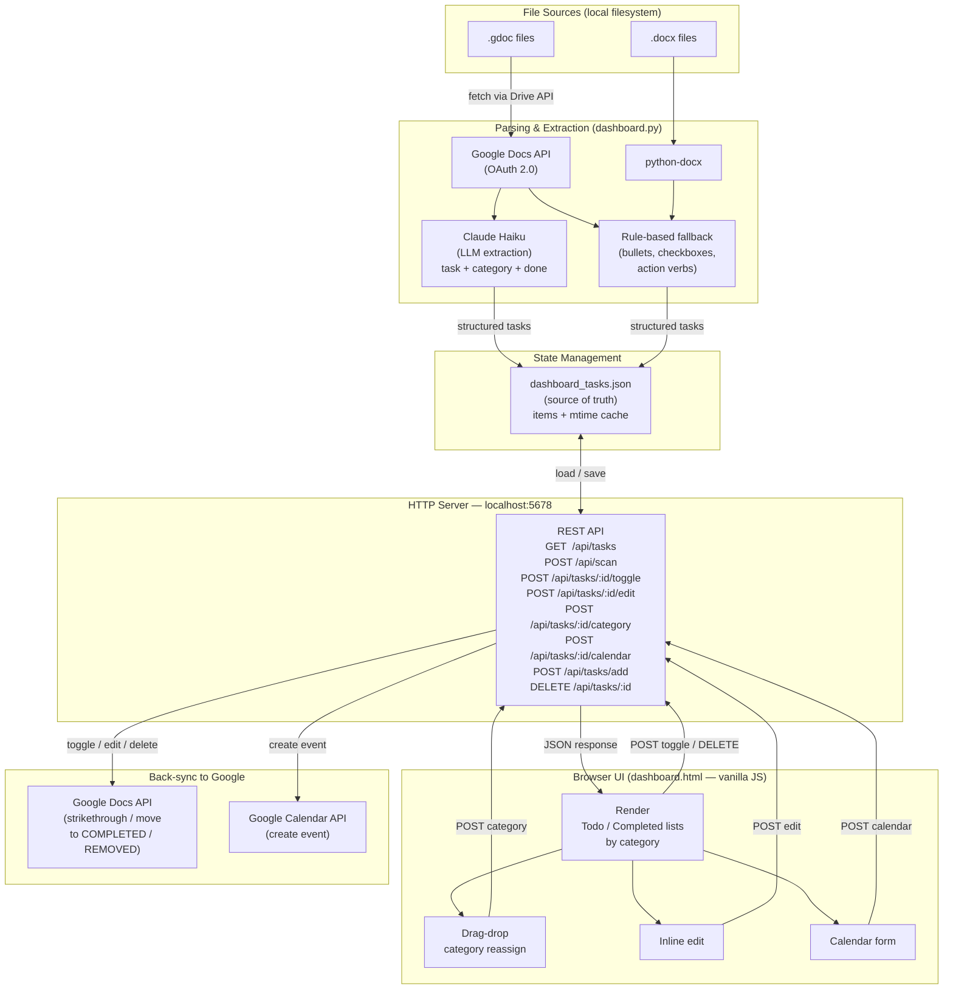

# Admin Tasks Dashboard

A local Python dashboard that scans Google Docs for to-do items, displays them in a browser UI with categories, and syncs completions/deletions back to the doc.

## Features

- Scans `.gdoc` and `.docx` files for tasks using Claude Haiku (LLM) or rule-based fallback
- Auto-categorises tasks into Holiday / Work / Finances / Other
- Marks items complete or removed directly in the source Google Doc
- Google Calendar integration — add tasks as events from the dashboard
- Inline editing synced back to the Google Doc
- Drag-and-drop category management
- Daily ntfy push notifications for tasks overdue by 7+ days

## Setup

### 1. Install dependencies

```bash
pip3 install -r requirements.txt
```

### 2. Google OAuth credentials

- Go to [Google Cloud Console](https://console.cloud.google.com)
- Create a project and enable the **Google Docs API**, **Google Drive API**, and **Google Calendar API**
- Create an OAuth 2.0 Desktop App credential
- Download the JSON and save it as `credentials.json` in this folder (use `credentials.example.json` as a reference for the expected shape)

### 3. Anthropic API key (optional — enables LLM task extraction)

Create a `.env` file in this folder:

```
ANTHROPIC_API_KEY=your_key_here
```

Get a key at [console.anthropic.com](https://console.anthropic.com). Without it the dashboard falls back to rule-based task extraction.

### 4. Overdue task alerts via ntfy (optional)

`check_alerts.py` sends a push notification to your phone for every incomplete task that is 7+ days old. It fires once per task per day, building up in your ntfy history until you mark things done.

**Install the ntfy app** on your phone (iOS / Android) and subscribe to a topic name of your choice (e.g. `alex-tasks-alerts`).

Add to your `.env`:

```
NTFY_TOPIC=alex-tasks-alerts
# NTFY_URL=https://ntfy.sh   # optional — only needed if self-hosting ntfy
```

**Test it manually:**

```bash
python3 check_alerts.py
```

**Schedule it with cron** (fires at 09:00 every day):

```bash
crontab -e
```

Add this line (replace the path with your actual install location):

```
0 9 * * * /usr/bin/python3 /path/to/admin-dashboard/check_alerts.py >> /tmp/dashboard_alerts.log 2>&1
```

Tasks overdue by 14+ days are sent at **high** priority in ntfy.

### 5. Run

```bash
python3 dashboard.py
```

The dashboard opens automatically at `http://localhost:5678`. On first run a browser tab will open for Google sign-in.

## How It Works

The dashboard is a single-server Python app that bridges your local Google Doc files with a browser UI.



### Key data flow

1. **Scan** — `dashboard.py` walks the filesystem for `.gdoc` and `.docx` files. For each Google Doc it fetches the full document via the Docs API (skipping unchanged files using an mtime cache). Word docs are parsed locally with `python-docx`.
2. **Extract** — Paragraphs are sent to Claude Haiku to identify tasks, infer categories (Holiday / Work / Finances / Other), and detect already-completed items. If the Anthropic API key is absent, a rule-based fallback fires instead (bullets, checkboxes, action-verb detection).
3. **Merge & persist** — Fresh items are merged with the existing `dashboard_tasks.json`, preserving user-set state (completed, deleted, category overrides, manually added tasks). The result is written to disk.
4. **Serve** — A lightweight Python `http.server` exposes a REST API consumed by the single-page HTML/JS frontend.
5. **Back-sync** — Every user action (toggle, edit, delete) is immediately reflected in the source Google Doc via the Docs API (strikethrough, text replacement, or moving the item to a COMPLETED / REMOVED section). Calendar events are created via the Calendar API.

## Files not in this repo

These are gitignored and must be created locally:

| File | Why excluded |
|---|---|
| `credentials.json` | Google OAuth client secret |
| `token.json` | Google OAuth token (auto-generated on first run) |
| `.env` | Contains your Anthropic API key and ntfy topic |
| `dashboard_tasks.json` | Your personal task data (auto-generated) |
